# Hi 👋, I'm Vishal Kumar

### 🚀 AI/ML Engineer in Progress | Machine Learning • MLOps • AI Infrastructure

🎓 Final Year B.Tech Student — Artificial Intelligence & Machine Learning • Graduating 2027

---

## 👨‍💻 About Me

- 🎓 Final Year B.Tech student specializing in Artificial Intelligence & Machine Learning
- 🤖 Building practical ML and AI systems
- 🔄 Exploring MLOps and production ML workflows
- 🧠 Building LLM and RAG applications
- ⚡ Exploring AI Infrastructure and systems engineering
- 🗄️ Building a database/vector-storage system from first principles
- 🐍 Primarily working with Python
- 💻 Strengthening DSA and software engineering fundamentals
- 🌍 Exploring open-source development

---

## 🛠️ Tech Stack

### Languages
**Python** • **SQL** • **C++ (Learning)**

### Machine Learning & Data Science
**NumPy** • **Pandas** • **Scikit-Learn** • **Matplotlib**

### AI & LLM Applications
**RAG** • **Embeddings** • **Sentence Transformers** • **ChromaDB**

### Backend & APIs
**Flask** • **REST APIs** • **FastAPI (Learning)**

### Databases
**MySQL** • **PostgreSQL (Learning)** • **MongoDB (Learning)**

### DevOps & Engineering
**Git** • **GitHub** • **Docker** • **Linux** • **VS Code**

### Currently Learning
**C++** • **Deep Learning** • **PyTorch** • **TensorFlow** • **MLflow** • **MLOps** • **LLMs** • **AI Infrastructure**

---

## 🚀 Current Focus

- 🧠 Machine Learning Engineering
- 🔄 MLOps & production ML workflows
- 🤖 LLM applications & RAG
- ⚡ AI Infrastructure
- 🗄️ Database & Vector Database Systems
- 🐳 Docker & Backend Development
- 💻 Data Structures & Algorithms
- 🌍 Open Source & Systems Engineering

---

## 🌟 Featured Projects

### 🤖 AI Incident Intelligence & MLOps Platform

End-to-end project exploring machine learning, incident detection, experiment tracking and MLOps workflows.

**Focus:** Python • Machine Learning • MLflow • Docker • MLOps

🔗 [View Repository](https://github.com/kumarv34605-star/ai-incident-platform)

---

### 🔎 AI Space Research Assistant

RAG-based research assistant using document processing, embeddings and vector search to retrieve information from technical documents.

**Focus:** RAG • Sentence Transformers • ChromaDB • Embeddings • LLMs

🔗 [View Repository](https://github.com/kumarv34605-star/AI-Space-Research-Assistant)

---

### 📊 Customer Churn Pipeline

Machine learning pipeline for predicting customer churn using a structured ML workflow.

**Focus:** Python • Pandas • Scikit-Learn • Machine Learning

🔗 [View Repository](https://github.com/kumarv34605-star/Customer-Churn-Pipeline)

---

### 🔥 Flask FWI Prediction

Machine learning application for Fire Weather Index prediction with a Flask backend.

**Focus:** Machine Learning • Scikit-Learn • Flask • REST API

🔗 [View Repository](https://github.com/kumarv34605-star/Flask-FWI-Prediction)

---

### 🧰 Loggable File Analyzer

Python CLI project focused on file analysis, structured logging and maintainable software design.

**Focus:** Python • CLI • Logging • Software Engineering

🔗 [View Repository](https://github.com/kumarv34605-star/loggable-file-analyzer)

---

## 🧪 Side Quest — VDB

### 🗄️ VDB — Building a Database From First Principles

A systems project focused on understanding how database and vector-storage systems work internally rather than treating them as black boxes.

**Exploring:**
- Storage engines & disk persistence
- Pages, records and serialization
- Indexing & B+ Trees
- Query execution
- Transactions & WAL
- Recovery
- Concurrency
- Networking
- Vector search

**Stack:** C++ • Linux • CMake

🔗 [View Repository](https://github.com/kumarv34605-star/vdb)

---

## 💻 DSA & Problem Solving

Building strong problem-solving skills alongside AI/ML and systems development.

- 🧩 **427 problems solved**
- 🟢 218 Easy
- 🟡 167 Medium
- 🔴 42 Hard
- 🏆 **Contest Rating: 1700**
- 📈 **Top 14.09%**
- 🔥 **157-day maximum streak**
- 📅 **241 active days**
- 🏅 **7 badges**
- 🎯 **10 contests attended**

🔗 [View LeetCode Profile](https://leetcode.com/u/VibeCoding01/)

---

## 🌱 Learning Path

```text
Machine Learning
       ↓
Deep Learning
       ↓
LLM Applications & RAG
       ↓
MLOps & ML Engineering
       ↓
AI Infrastructure
```

Alongside:

```text
DSA → Backend Development → Systems Fundamentals
```

---

## 🌍 Open Source

Exploring open-source development and learning how real-world software is built, reviewed and maintained.

🔗 [GitHub Profile](https://github.com/kumarv34605-star)

---
---

## 📊 GitHub Activity

<p align="center">
  
</p>

<p align="center">
  
</p>

---

## 🐍 Contribution Activity

<p align="center">
  
</p>

---

## 🏆 GitHub Trophies

<p align="center">
  
</p>
---

### 📫 Connect With Me

<p align="left">

<a href="https://www.linkedin.com/in/vishal-kumar-1247802ba/">

</a>

<a href="https://leetcode.com/u/VibeCoding01/">

</a>

<a href="https://github.com/kumarv34605-star">

</a>

</p>

---

> *Learning, building, and improving one system at a time.*
